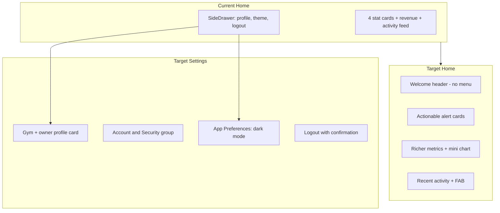
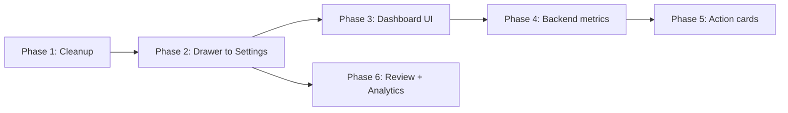

# Gymetric Dashboard & Settings Overhaul

## Current State

**GymKarta** is an Expo/React Native gym admin app (members, memberships, revenue, WhatsApp automation) with a Fastify/MongoDB backend. The Home tab is the dashboard; navigation is bottom tabs + stack. The side drawer (`[SideDrawer.tsx](frontend/Gymetric/app/screens/Home/SideDrawer.tsx)`) only holds gym profile, dark mode, and logout — not navigation links.

RentVelo reference: bottom tabs only, grouped Settings with profile card + inline toggles, dashboard cards with actionable CTAs, `expo-store-review` (no custom popup), and **frontend-only Firebase Analytics**.




---

## Phase 1: Remove Unnecessary Frontend Files

Delete Ignite leftovers and dead code. After removal, run `npm install` to drop unused deps.

**Screens / components to delete:**

- `[app/screens/LoginScreen.tsx](frontend/Gymetric/app/screens/LoginScreen.tsx)` — replaced by Auth flow, not registered
- `[app/screens/Home/SideDrawer.tsx](frontend/Gymetric/app/screens/Home/SideDrawer.tsx)` — moving content to Settings
- `[app/components/DrawerIconButton.tsx](frontend/Gymetric/app/components/DrawerIconButton.tsx)`
- `[app/components/Card.tsx](frontend/Gymetric/app/components/Card.tsx)`
- `[app/components/AutoImage.tsx](frontend/Gymetric/app/components/AutoImage.tsx)`
- `[app/components/HeaderbackButton.tsx](frontend/Gymetric/app/components/HeaderbackButton.tsx)` — imported but never rendered
- `[app/utils/useHeader.tsx](frontend/Gymetric/app/utils/useHeader.tsx)`
- `[app/utils/crashReporting.ts](frontend/Gymetric/app/utils/crashReporting.ts)` — stub, never initialized

**i18n — remove entirely (per your choice):**

- Delete all of `[app/i18n/](frontend/Gymetric/app/i18n/)` (16 files including demo-* and locale files)
- Remove i18n init from `[app/app.tsx](frontend/Gymetric/app/app.tsx)`
- Remove `i18next` / `react-i18next` from `[package.json](frontend/Gymetric/package.json)`
- Fix any remaining `tx` / `translate()` references (likely only ErrorBoundary)

**Navigation / config cleanup:**

- Remove stale routes (`Login`, `Welcome`, `Demo`) from `[navigationTypes.ts](frontend/Gymetric/app/navigators/navigationTypes.ts)` and `[app.tsx](frontend/Gymetric/app/app.tsx)` linking config
- Remove dead `loginAPI` call path if only used by deleted LoginScreen
- Delete `.maestro/flows/FavoritePodcast.yaml` (tests nonexistent demo screen)

**Dependencies to remove:**

- `react-native-drawer-layout` (only used in Home.tsx)
- `i18next`, `react-i18next` (if present)

**Dead imports to clean** in: `BusinessProfile.tsx`, `Memberships.tsx`, `HelpCenter.tsx`, `Revenue.tsx`, `UpdateClientBasicInfo.tsx`

---

## Phase 2: Remove Drawer — Move to Settings

`**[Home.tsx](frontend/Gymetric/app/screens/Home/Home.tsx)`:**

- Remove `Drawer` wrapper, `SideDrawer` import, `open` state, and hamburger `Menu` button
- Simplify header to RentVelo-style welcome row: gym logo/avatar + greeting + owner name (no menu icon)

**Redesign `[Setting.tsx](frontend/Gymetric/app/screens/Setting/Setting.tsx)`** following RentVelo `[SettingsScreen.tsx](/Users/pushkarasharma/Desktop/Personal/RentVelo/RentVelo/src/screens/settings/SettingsScreen.tsx)`:


| Section                | Items                                                                                                                                                                     |
| ---------------------- | ------------------------------------------------------------------------------------------------------------------------------------------------------------------------- |
| **Profile card** (top) | Gym logo, name, address, owner username + role badge — content currently in SideDrawer                                                                                    |
| **Account & Security** | Manage Membership, Business Profile, Change Password -> here I have one insight ( profile card itself is business profile -> so we can open it direclty onclick of card ) |
| **Notifications**      | WhatsApp settings (conditional)                                                                                                                                           |
| **App Preferences**    | Dark Mode toggle (inline `Switch`, persisted via existing `setThemeContextOverride` in `[theme/context.tsx](frontend/Gymetric/app/theme/context.tsx)`)                    |
| **Support**            | Help Center, Terms                                                                                                                                                        |
| **Footer**             | Logout button (danger-tinted, with confirmation modal), app version                                                                                                       |


Extract a reusable `SettingItem` inline component (colored icon box + label + chevron/toggle) matching RentVelo's pattern. Add a simple `ConfirmationModal` for logout (RentVelo pattern — no new library needed).

---

## Phase 3: Dashboard UI Refresh (RentVelo Style)

Restructure `[Home.tsx](frontend/Gymetric/app/screens/Home/Home.tsx)` into composable components under `app/components/dashboard/`:


| Component           | RentVelo reference                    | Gymetric purpose                                            |
| ------------------- | ------------------------------------- | ----------------------------------------------------------- |
| `DashboardHeader`   | Avatar + welcome row                  | Greeting, owner name, optional gym logo                     |
| `RevenueCard`       | `FinancialSummary` side-by-side cards | Primary revenue MTD with trend badge                        |
| `StatGrid`          | 2-column stat cards                   | Members, active, expiring, new joinees                      |
| `RevenueTrendChart` | `CollectionTrends`                    | 6-month mini bar chart (data already exists in revenue API) |
| `ActionAlertCard`   | `PendingAlert`                        | High-priority actionable card (see Phase 4)                 |
| `GetStartedCard`    | `GetStartedCard`                      | Onboarding checklist for new gyms                           |
| `ActivityFeed`      | —                                     | Existing recent activity list                               |


**Card styling to adopt from RentVelo:**

```typescript
backgroundColor: colors.surface
borderRadius: 16–20
borderWidth: 1, borderColor: colors.border
subtle shadow
uppercase labels (10–12px, letterSpacing: 1)
```

Keep existing Moti animations, skeleton loading, pull-to-refresh, and FAB (+ Add Client).

---

## Phase 4: Richer Dashboard Analytics (Backend + Frontend)

### Product gap today

Dashboard shows 5 metrics + activity feed. Revenue chart and payment breakdown live only on the separate Revenue screen. Backend already computes more in `[clientController.getClientStats](server/src/controllers/clientController.ts)` (`expiredMembers`, `upcomingMembers`) but this is **not exposed on the dashboard summary**.

### Extend `[dashboardController.ts](server/src/controllers/dashboardController.ts)` `getDashboardSummary` response:


| New field             | Business value                                                                       |
| --------------------- | ------------------------------------------------------------------------------------ |
| `expiredMembers`      | Churn visibility — members lost, re-engagement opportunity                           |
| `upcomingMembers`     | Future revenue pipeline                                                              |
| `retentionRate`       | `(active / totalClients) * 100` — health score                                       |
| `avgRevenuePerMember` | `revenueThisMonth / activeMembers` — pricing insight                                 |
| `revenueTrend`        | Last 6 months array (reuse logic from `getRevenueStats`) — inline chart on dashboard |
| `expiringMembersList` | Top 5 expiring in 7 days (name + days left) — powers actionable card                 |


### Dashboard layout (top to bottom):

1. Welcome header
2. **GetStartedCard** (if gym has 0 clients OR no membership plans OR WhatsApp not configured)
3. **ExpiringSoonAlert** — "X members expiring in 7 days" + CTA → Clients (Expiring Soon filter); if WhatsApp configured, secondary CTA → Notification Settings
4. Revenue card (tappable → Revenue screen)
5. Stat grid (2x2) — add **Expired** count as 5th stat or replace "Total Members" row with 3-column: Active / Expired / Upcoming - There is no need of upcming ( since upcoming case is very less people join first and later give fees or on the day of joining ) 
6. **Revenue trend mini-chart** (6 months, inline — no need to navigate)
7. Recent activity feed

---

## Phase 5: Actionable Dashboard Items (PO / BA View)

Current dashboard is **read-only with navigation**. Owners need **decision prompts**, not just numbers.

### High-impact actionable cards (implement in this pass)


| Action                    | Trigger condition        | CTA                                                     | Why it matters                                      |
| ------------------------- | ------------------------ | ------------------------------------------------------- | --------------------------------------------------- |
| **Expiring Soon Alert**   | `expiringIn7Days > 0`    | "View Members" / "Send Reminders"                       | Direct revenue protection — #1 gym owner pain point |
| **Get Started Checklist** | Missing setup steps      | Step links: Create Plan → Add Client → Connect WhatsApp | Reduces time-to-value for new gyms                  |
| **Expired Members Alert** | `expiredMembers > 0`     | "Re-engage" → Clients (Expired filter)                  | Win-back opportunity                                |
| **WhatsApp Upsell**       | Already exists as banner | Keep, restyle as RentVelo alert card                    | Automation = retention                              |


### Quick Actions row (optional, low effort)

Horizontal chip row below header: **+ Add Client** | **Search** | **Revenue** — reduces taps for daily tasks.

### Deferred (future phases — not in this pass)

- Bulk WhatsApp reminder from dashboard (needs backend batch endpoint)
- Privacy mode (mask revenue like RentVelo)
- "Today's collections" real-time widget
- Churn prediction / cohort analysis

---

## Phase 6: App Review + Analytics

### App Review — Frontend only (match RentVelo)

RentVelo uses **native OS dialog** via `expo-store-review`, not a custom popup. Replicate exactly:

**New file:** `app/services/storeReviewService.ts` — copy logic from [RentVelo `storeReviewService.ts](/Users/pushkarasharma/Desktop/Personal/RentVelo/RentVelo/src/services/storeReviewService.ts)`

**Trigger after positive actions (≥3 count, ≥1 month between prompts):**

- `[ClientOnboarding.tsx](frontend/Gymetric/app/screens/Clients/ClientOnboarding.tsx)` — client onboarded
- `[RenewMembership.tsx](frontend/Gymetric/app/screens/Clients/ClientMembership/RenewMembership.tsx)` — membership renewed
- `[CreateEditMembership.tsx](frontend/Gymetric/app/screens/Setting/Memberships/CreateEditMembership.tsx)` — plan created (first time only)

**Storage keys (MMKV):** `@store_review_action_count`, `@store_review_last_prompt_date`, `@store_review_has_reviewed`

**Dependency:** `expo-store-review` (add via `npx expo install expo-store-review`)

### Analytics — Frontend only (recommended)


| Approach                        | Verdict                                                                                                                                     |
| ------------------------------- | ------------------------------------------------------------------------------------------------------------------------------------------- |
| **Frontend Firebase Analytics** | **Recommended** — matches RentVelo, handles aggregation, screen views, funnels, user properties. No backend work.                           |
| **Backend event logging**       | Overkill for usage understanding; adds API surface, storage, and privacy complexity. Only consider for cross-device admin dashboards later. |
| **Backend Sentry**              | Already active for errors — keep separate from product analytics                                                                            |


**New files:**

- `app/services/analyticsService.ts` — port from [RentVelo analyticsService.ts](/Users/pushkarasharma/Desktop/Personal/RentVelo/RentVelo/src/services/analyticsService.ts)
- `firebase.json` — disable auto-collection, manual screen tracking only
- `app/services/crashlyticsService.ts` — optional, replaces dead `crashReporting.ts` stub

**Dependencies to add:**

- `@react-native-firebase/analytics`
- `@react-native-firebase/crashlytics` (optional)

**Key events for Gymetric:**


| Event                     | When                      |
| ------------------------- | ------------------------- |
| `app_opened`              | App launch                |
| `screen_view`             | Navigation state change   |
| `sign_in` / `sign_out`    | Auth + Settings logout    |
| `client_added`            | Client onboarding success |
| `membership_renewed`      | Renewal success           |
| `membership_plan_created` | Plan created              |
| `whatsapp_connected`      | Settings configured       |
| `dashboard_stat_tapped`   | Stat card navigation      |


**User properties:** `gym_id`, `total_clients`, `active_members`, `has_whatsapp`, `dark_mode`, `app_version`, `days_since_signup`

**Dev guard:** Disable collection in `__DEV__`, console.log only (RentVelo pattern).

Firebase is already wired in `[app.config.ts](frontend/Gymetric/app.config.ts)` with `google-services.json` — only SDK packages and service files are missing.

---

## Phase 7: Broader Product Improvements (Recommendations)

These are **not in this pass** but worth prioritizing next:

1. **Clients tab — "Expired" filter** — backend supports `expired`/`trial_expired` status; ensure frontend filter chip exists and dashboard CTAs land there
2. **Revenue screen merge into dashboard** — after mini-chart ships, Revenue screen becomes detail drill-down (payment methods + transactions)
3. **WhatsApp bulk reminders** — "Send expiry reminders to all 5 members" from dashboard alert (high ROI for premium feature)
4. **Multi-staff / roles** — currently single owner; future gyms will need staff accounts with limited permissions
5. **Offline / sync** — RentVelo uses SQLite locally; Gymetric is API-dependent. Consider optimistic UI + retry for poor gym WiFi
6. **Member self-service portal** — let members check expiry / renew via link (reduces owner workload)
7. **Automated re-engagement** — cron already handles expiry; add "win-back" WhatsApp template for expired members
8. **Onboarding analytics funnel** — track drop-off at OTP → gym setup → first client to optimize activation
9. **Privacy mode** — mask revenue amounts on dashboard (RentVelo has this; useful in shared gym front-desk scenarios)
10. **What's New modal** — show on OTA version bump (RentVelo `WhatsNewModal` pattern)

---

## Implementation Order




Phases 4–6 can partially overlap. Analytics/review can ship independently of UI once cleanup is done.

---

## Key Files to Modify


| File                                                                      | Change                                 |
| ------------------------------------------------------------------------- | -------------------------------------- |
| `[Home.tsx](frontend/Gymetric/app/screens/Home/Home.tsx)`                 | Remove drawer, new layout + components |
| `[Setting.tsx](frontend/Gymetric/app/screens/Setting/Setting.tsx)`        | Full RentVelo-style redesign           |
| `[dashboardController.ts](server/src/controllers/dashboardController.ts)` | Extended summary payload               |
| `[Api.ts](frontend/Gymetric/app/services/Api.ts)`                         | Types for new dashboard fields         |
| `[app.tsx](frontend/Gymetric/app/app.tsx)`                                | Remove i18n, add analytics init        |
| `[package.json](frontend/Gymetric/package.json)`                          | Add/remove deps                        |


## Risk Notes

- Removing i18n is safe — screens already use hardcoded English
- Dashboard API extension is backward-compatible (additive fields)
- Firebase Analytics requires a production build to verify events (dev mode logs only)
- Store review won't show in Expo Go — needs dev client / TestFlight build

